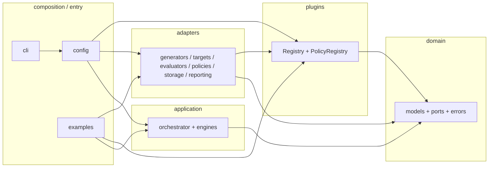
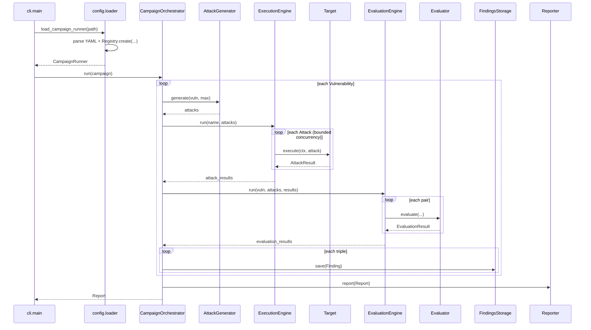

# Architecture

`llm-redteam-firewall` is a **pluggable LLM red-team harness** built with
**Clean Architecture / Hexagonal Architecture**. Domain logic sits at the
center and knows nothing about frameworks or I/O. Everything else —
adapters, config, CLI — depends *inward* on the domain, never the reverse.

> **Status (v0.1.0):** Scaffold with a fully wired campaign pipeline and a
> rule-based policy framework. Dummy/mock/in-memory adapters run end-to-end
> without network access. Several real integrations remain
> `NotImplementedError` stubs (see [§10](#10-implementation-status--extension-points)).

---

## 1. Purpose

Red-teaming an LLM application means running the same shape of pipeline
against wildly different systems:

| Concern | Examples |
|---------|----------|
| **Targets** | Hosted API, in-house agent, RAG pipeline, local model |
| **Attack sources** | Static prompts, fuzzing library, LLM mutator |
| **Graders** | Keyword rules, judge model, classifier |
| **Firewall rules** | PII / secret / prompt-leak / tool-misuse detectors |

This framework treats all of those as **swappable plugins** behind narrow
interfaces, so orchestration — *for each vulnerability: generate → execute →
evaluate → store → report* — never has to change when an adapter is swapped.

There is a second, parallel path for **policy evaluation** (firewall rules
over any attack/response pair), independent of the campaign vulnerability list.

---

## 2. High-level flows

### 2.1 Campaign pipeline

```
Campaign
  └─ for each Vulnerability
       ├─ AttackGenerator.generate(...)  → list[Attack]
       ├─ ExecutionEngine  ──► Target.execute(...)  → list[AttackResult]
       ├─ EvaluationEngine ──► Evaluator.evaluate(...) → list[EvaluationResult]
       ├─ build Finding(s) → FindingsStorage.save(...)
       └─ Report → Reporter.report(...)  (×N reporters)
```

### 2.2 Policy (firewall) pipeline

```
Attack + Response
  └─ PolicyEngine
       └─ for each Policy in PolicyRegistry
            └─ Policy.evaluate(attack, response) → list[Finding]
       └─ aggregate all findings
```

Policies are **rule-based** today (regex / pattern matching). They do not
require a campaign vulnerability list and are not yet wired into
`CampaignOrchestrator` (they can be invoked independently via `PolicyEngine`).

---

## 3. Repository layout

```
llm-redteam-firewall/
├── pyproject.toml                 # package metadata, deps, tool config
├── Makefile                       # install, test, lint, example runners
├── README.md
├── ARCHITECTURE.md                # this file
├── LICENSE
├── configs/
│   └── example_campaign.yaml      # YAML-driven smoke campaign
├── examples/
│   └── run_example_campaign.py    # programmatic smoke campaign
├── src/
│   └── llm_redteam_firewall/
│       ├── __init__.py            # package version + public orientation
│       ├── domain/                # innermost ring — zero project deps
│       │   ├── errors.py
│       │   ├── models/            # entities & value objects (dataclasses)
│       │   └── ports/             # interfaces (ABC / Protocol)
│       ├── application/           # use cases — depends only on domain
│       ├── adapters/              # concrete port implementations
│       │   ├── generators/
│       │   │   └── garak/         # multi-module Garak AttackGenerator adapter
│       │   ├── targets/
│       │   ├── evaluators/
│       │   ├── policies/
│       │   ├── storage/
│       │   └── reporting/
│       ├── plugins/               # Registry + PolicyRegistry
│       ├── config/                # composition root (YAML → wired runner)
│       └── cli/                   # thin argparse entrypoint
└── tests/                         # mirrors package layout
    ├── domain/
    ├── application/
    ├── adapters/
    ├── plugins/
    ├── config/
    └── conftest.py
```

---

## 4. Layered architecture

```
┌─────────────────────────────────────────────────────────────┐
│  cli  /  examples                                           │  outer
├─────────────────────────────────────────────────────────────┤
│  config  (composition root: YAML parse + DI wiring)         │
├─────────────────────────────────────────────────────────────┤
│  adapters  (generators, targets, evaluators, policies, …)   │
│  plugins   (name → factory / instance registries)           │
├─────────────────────────────────────────────────────────────┤
│  application  (CampaignOrchestrator, engines)               │
├─────────────────────────────────────────────────────────────┤
│  domain  (models, ports, errors)                            │  inner
└─────────────────────────────────────────────────────────────┘
```

### 4.1 Dependency rules



| Package | May import | Must not import |
|---------|------------|-----------------|
| `domain` | stdlib only | anything else in this project |
| `application` | `domain` only | `adapters`, `plugins`, `config`, `cli` |
| `plugins` | `domain.ports` (typing) | `application`, `adapters`, `config` |
| `adapters.*` | `domain`, `plugins` | `application`, other adapter packages, `config`, `cli` |
| `config` | **everything** (composition root) | — |
| `cli` | `config` (+ domain errors for exit codes) | adapters / application directly |

**Practical effect:** `CampaignOrchestrator` has never heard of `MockTarget` or
`DummyAttackGenerator`. It only depends on ports (`AttackGenerator`, `Target`,
`Evaluator`, `FindingsStorage`, `Reporter`) and application engines.

---

## 5. Domain layer

Path: `src/llm_redteam_firewall/domain/`

The domain is framework-free: plain dataclasses, enums, ABCs/Protocols, and
a small exception hierarchy. No Pydantic, no YAML, no HTTP clients.

### 5.0a Attack planning (`domain.campaigns`)

A planning layer between `Campaign`/`AttackGenerator` and `ExecutionEngine`:

```
Campaign -> AttackGenerator -> list[Attack] -> AttackCampaign (batches of AttackBatch) -> ExecutionEngine
```

- `AttackBatch` — one or more `Attack`s plus declared (not yet enforced)
  `execution_strategy` (`sequential`/`parallel`), `retry_policy`,
  `timeout_seconds`, `max_concurrency`, and `metadata`.
- `AttackCampaign` — an ordered tuple of `AttackBatch`, campaign-level
  `execution_strategy` and `metadata`, and an `attacks` property that
  flattens every batch back into a single `tuple[Attack, ...]` in order.
  `AttackCampaign.from_attacks(name, attacks)` wraps a flat attack list
  (what `AttackGenerator.generate()` already returns) into a single
  batch — this is the compatibility path `CampaignOrchestrator` uses.

`CampaignOrchestrator` wraps each vulnerability's generated attacks in
an `AttackCampaign` and iterates its batches rather than the raw list
directly, but since `from_attacks` always produces exactly one batch
containing every attack in original order, `ExecutionEngine`/
`EvaluationEngine` still receive the identical flat sequence they
always did — no behavior change, only the added abstraction. No
scheduler, retry loop, or concurrency limiter reads
`execution_strategy`/`retry_policy`/`max_concurrency` yet.

### 5.0 Vulnerability catalog (`domain.vulnerabilities`)

A separate subpackage, not a `domain.models` entity: `VulnerabilityDefinition`
(`id`, `name`, `description`, `default_attack_generator`,
`default_attack_categories`, `default_policies`, `severity`, `tags`) is
reference data describing a *kind* of vulnerability, distinct from the
`Vulnerability` a campaign actually authors. `VulnerabilityRegistry`
(`register` / `get` / `all` / `names`) holds them by id, pre-seeded with
six built-ins (`prompt_injection`, `jailbreak`, `prompt_leakage`,
`pii_leakage`, `secret_leakage`, `tool_misuse`) at the module-level
singleton `VULNERABILITY_REGISTRY`. `to_vulnerability(definition, ...)`
projects a definition into a concrete `Vulnerability`, carrying the
implementation defaults in `Vulnerability.metadata` rather than adding
new fields to that entity.

This lets a campaign reference a vulnerability by id alone —
`config.loader` resolves `{id: pii_leakage}` (no `name`/`category`)
against the registry; explicit `name`+`category` in YAML still bypasses
the registry entirely, unchanged from before. Nothing here imports
`plugins` or `adapters` — the definitions only carry plugin *names* as
strings, so the domain layer's "stdlib only" import rule holds. Garak
probe mapping is an intentional gap: no field for it exists yet (see
§10).

### 5.1 Models (`domain.models`)

| Entity | Role |
|--------|------|
| `Severity` | Ordered scale: `low` → `medium` → `high` → `critical` |
| `Vulnerability` | Named class of undesirable behavior to probe |
| `Campaign` | Named run: vulnerabilities + limits (max attacks, concurrency) |
| `Attack` | One concrete probe prompt (immutable) |
| `AttackResult` | Target output (or error) for one attack |
| `Response` | Policy-facing view of target output; converts to/from `AttackResult` |
| `ExecutionContext` | Per-execution metadata (campaign name, timeout) |
| `EvaluationResult` | Verdict produced by an `Evaluator`: `passed=True` means target *resisted* the attack |
| `Finding` | Full story: vulnerability + attack + result + verdict (`passed`/`reasoning`/`score`/`source` as plain fields, not a nested `EvaluationResult`); unit of storage/report |
| `FindingStatus` | Lifecycle: open, confirmed, false_positive, accepted_risk, resolved |
| `Report` | Immutable end-of-campaign summary (`pass_rate`, `vulnerable_findings`) |

**Campaign data flow (entities):**

```
Campaign → Vulnerability → Attack → AttackResult
         → EvaluationResult → Finding → Report
```

**Policy data flow (entities):**

```
Attack + Response → Finding  (via Policy._finding helper)
```

`Finding` does not embed `EvaluationResult` — it carries its verdict as
plain fields (`passed`, `reasoning`, `score`, `source`). This is what
keeps the two data flows above genuinely independent: `Policy` (and its
`_finding` helper) never imports or constructs `EvaluationResult`, and
`EvaluationResult` is only ever created by `Evaluator` implementations
(and `EvaluationEngine`, which orchestrates them). `CampaignOrchestrator`
is the sole place that reads an `EvaluationResult`'s fields to populate
a `Finding`, for the campaign pipeline's evaluator-sourced findings.

Convention for grading:

- `EvaluationResult.passed = True` → safe / resisted
- `EvaluationResult.passed = False` → vulnerability triggered → finding is “vulnerable”
- `Finding.is_vulnerable` ≡ `not finding.passed` (true regardless of
  whether the finding came from an `Evaluator` or a `Policy`)

### 5.2 Ports (`domain.ports`)

Ports are the hexagon’s boundary. Application code depends only on these.

| Port | Kind | Responsibility |
|------|------|----------------|
| `AttackGenerator` | ABC | `generate(vulnerability, max_attacks) → list[Attack]` |
| `Target` | ABC | `async execute(ctx, attack) → AttackResult` |
| `Evaluator` | ABC | `async evaluate(vuln, attack, result) → EvaluationResult` |
| `Policy` | ABC | `evaluate(attack, response) → list[Finding]` |
| `Reporter` | ABC | `report(report) → None` |
| `FindingsStorage` | Protocol | `save(finding)`, `list(campaign_name?)` |

`Policy` includes a protected `_finding(...)` helper so rule adapters can emit
consistent `Finding` objects without re-implementing vulnerability/result wiring.

### 5.3 Errors (`domain.errors`)

```
RedTeamError
├── AttackGenerationError
├── TargetExecutionError
├── EvaluationError
├── StorageError
├── ConfigurationError
└── PluginNotFoundError
```

Adapters translate SDK/HTTP failures into these types so the application layer
never imports adapter-specific exceptions.

---

## 6. Application layer

Path: `src/llm_redteam_firewall/application/`

Use cases that orchestrate ports. **No knowledge of concrete adapters.**

### 6.1 `CampaignOrchestrator`

Top-level campaign use case. Shape of a full run:

1. For each `Vulnerability` in the campaign  
2. Generate attacks via `AttackGenerator`  
3. Execute via `ExecutionEngine`  
4. Grade via `EvaluationEngine`  
5. Build `Finding`s, persist via `FindingsStorage`  
6. Build one immutable `Report`  
7. Invoke every configured `Reporter`

Does **not** currently invoke `PolicyEngine` (policies are a separate path).

### 6.2 `ExecutionEngine`

- Runs a batch of attacks against one `Target`
- Bounded concurrency (`asyncio.Semaphore`)
- Per-attack timeout (`asyncio.wait_for`)
- Individual failures become `AttackResult(error=...)` rather than aborting the batch

### 6.3 `EvaluationEngine`

- Pairs attacks with attack results (strict length check)
- Bounded concurrency
- Failed target executions are treated as **non-vulnerable** (`passed=True`) —
  no evidence of a security issue if the target never answered

### 6.4 `PolicyEngine`

- Accepts an explicit sequence of `Policy` instances (typically `POLICIES.all()`)
- Runs every policy on each attack/response pair and aggregates findings
- Optional `campaign_name` stamped onto findings that leave it empty
- `evaluate_batch` for many pairs

---

## 7. Plugin system

Path: `src/llm_redteam_firewall/plugins/`

### 7.1 Factory `Registry[T]`

Used for **pick-one-by-config** ports:

| Global | Category string | Port |
|--------|-----------------|------|
| `GENERATORS` | `generators` | `AttackGenerator` |
| `TARGETS` | `targets` | `Target` |
| `EVALUATORS` | `evaluators` | `Evaluator` |
| `STORAGE` | `storage` | `FindingsStorage` |
| `REPORTERS` | `reporters` | `Reporter` |

Features:

- `@REGISTRY.register("name")` decorator (in-tree)
- `register_factory(name, factory)` imperative API
- `create(name, **kwargs)` instantiation
- Lazy setuptools **entry-point** discovery under
  `llm_redteam_firewall.<category>` for out-of-tree plugins

### 7.2 `PolicyRegistry` (`POLICIES`)

Policies are different: the engine runs **all** registered rules, not one
chosen by config type. `PolicyRegistry` therefore stores **live instances**:

```python
@POLICIES.register
class PromptLeakPolicy(Policy):
    name = "prompt_leak"
    ...
```

API: `add`, `register` (decorator), `get`, `all`, `names`, `clear`.

---

## 8. Adapters

Path: `src/llm_redteam_firewall/adapters/`

Outer ring of the hexagon. Each subpackage implements one port, self-registers
on import, and never imports `application` or sibling adapter packages.

Importing `llm_redteam_firewall.adapters` registers **all** in-tree plugins
as a side effect (used by config loader, CLI, tests, examples).

### 8.1 Generators (`adapters.generators`)

| Name | Status | Notes |
|------|--------|-------|
| `dummy` | **Functional** | Template prompts from vulnerability description (`adapters/generators/dummy_generator.py`) |
| `garak` | **Functional** (requires `garak` extra) | Reads Garak's probe corpus (`adapters/generators/garak/`) — see §8.1a |

Both register into the same `GENERATORS` factory registry (§7.1); `generator: {type: garak}` in
YAML needs no other change anywhere in the framework. `garak` is a subpackage
(`adapters/generators/garak/`, multiple collaborator modules) sitting alongside the single-file
`dummy_generator.py` in the same `adapters.generators` package — Python allows mixing single-file
and multi-file adapters in one package directory, and the registry, config schema, and every
consumer of `AttackGenerator` are unaware of the difference either way.

### 8.1a Garak integration (`adapters.generators.garak`)

**What this integration does, precisely:** `GarakAttackGenerator` reads prompts out of Garak's
probe corpus and converts them into this framework's `Attack` objects. It never calls Garak's
`Probe.probe(generator)` — verified against Garak's source, that method both mints Garak
`Attempt`s *and executes them* against whatever `garak.generators.base.Generator` is passed in,
i.e. it is Garak's own execution stage. Calling it would mean asking Garak to run attacks against
a Garak-specific model wrapper, duplicating and conflicting with this framework's own
`ExecutionEngine`. Instead, each selected probe is only *instantiated* (which runs its `__init__`
— where Garak populates `self.prompts`, before `probe()` is ever called) and its `.prompts` list
is read directly. Garak's `Generator`, `Harness`, and `Detector` types are never touched by this
framework; grading stays entirely `EvaluationEngine`/`PolicyEngine`'s job, as for every other
generator.

Module layout (`src/llm_redteam_firewall/adapters/generators/garak/`):

| File | Responsibility |
|------|-----------------|
| `models.py` | `GarakProbeInfo` (probe metadata, read without instantiating), `ProbeMappingRule` |
| `probe_registry.py` | `ProbeRegistry`: discovers probes via `garak._plugins.enumerate_plugins("probes")` (no hardcoded probe list); reads class-level metadata (`tags`/`goal`/`primary_detector`/...) via `getattr` on the imported class, without instantiating; `load_probe_instance()` is the one place a probe actually gets constructed |
| `probe_selector.py` | `ProbeSelector` + `DEFAULT_PROBE_MAPPING`: resolves a vulnerability id into a filtered, deterministically-sorted probe list |
| `mapper.py` | `garak_prompts_to_attacks()`: converts one probe's raw `.prompts` entries into `Attack` objects |
| `generator.py` | `GarakAttackGenerator` (the only `@GENERATORS.register` in this package) |

**Only this package imports `garak`, and even here the import is lazy** (inside
`ProbeRegistry`'s methods, never at module scope) — so
`import llm_redteam_firewall.adapters` (done eagerly by the config loader, the CLI, and every
test's `conftest.py`) never fails just because Garak isn't installed. Only actually calling
`GarakAttackGenerator.generate()` (or `ProbeRegistry`'s methods directly) without Garak installed
raises a clear `GarakNotInstalledError` (a `ConfigurationError` subclass) naming the `garak` extra.

**Supported probe shapes:** any Garak probe whose `.prompts` entries are plain `str` or
`garak.attempt.Message` (has a `.text` attribute) — this covers the large majority of Garak's
probe corpus (`dan`, `promptinject`, `encoding`, `apikey`, `malwaregen`, ...).

**Unsupported probe shapes:** probes whose `.prompts` entries are `garak.attempt.Conversation`
objects (multi-turn) are not representable by this framework's single-turn `Attack.prompt: str`
field — `mapper.py` skips any entry it cannot extract plain text from, rather than guessing.
Probe modules that themselves fail to import (e.g. requiring Garak's own optional extras — audio
or image processing deps not installed even though the base `garak` package is) are skipped
during discovery with a warning, rather than aborting `list_probes()` entirely.

**Probe mapping (configurable, not hardcoded):** `ProbeSelector` resolves a vulnerability id
(matching this framework's `VulnerabilityDefinition.id`, §5.0) into Garak probes via a
`dict[str, ProbeMappingRule]`, where each rule is `include_patterns` (glob, matched against
`module.ClassName`; a bare module name like `"dan"` is shorthand for `"dan.*"`), `include_tags`,
and `exclude_tags`. `DEFAULT_PROBE_MAPPING` (in `probe_selector.py`) is a best-effort starting
point built from real Garak module names verified against Garak's source at integration time —
**not** an authoritative mapping published by Garak itself (no such canonical mapping exists):

| Vulnerability id | Default probe pattern(s) | Confidence |
|---|---|---|
| `prompt_injection` | `promptinject.*`, `latentinjection.*` | direct match |
| `jailbreak` | `dan.*`, `encoding.*`, `suffix.*`, `grandma.*`, `dra.*` | direct match |
| `prompt_leakage` | `leakreplay.*`, `sysprompt_extraction.*`, `divergence.*` | direct match |
| `pii_leakage` | `leakreplay.*`, `donotanswer.*` | **approximate** — no dedicated Garak PII module exists |
| `secret_leakage` | `apikey.*` | direct match |
| `tool_misuse` | `exploitation.*`, `packagehallucination.*` | **approximate** — no dedicated Garak "excessive agency" module exists |

Override or extend this entirely from YAML via the `probe_mapping` param (see the config example
below) — nothing here is baked into `if vulnerability.id == ...:` branching logic.

**Extension points:**

- Add/replace mapping rules per-deployment via `generator.params.probe_mapping`, no code change.
- `ProbeRegistry`/`ProbeSelector` are plain constructor-injectable collaborators — a project could
  swap in a different `ProbeRegistry` (e.g. one backed by a curated allowlist) without touching
  `GarakAttackGenerator`.
- A future `garak_detector`-backed `Evaluator` could read the `primary_detector`/
  `extended_detectors` metadata this integration already preserves on every `Attack.metadata` —
  not implemented here (out of scope; this integration only touches Garak's probe corpus).

**Known Garak limitations affecting this integration** (none are workarounds attempted here —
each is a documented, deliberate scope boundary):

1. **Multi-turn probes are dropped.** Garak's `Conversation`-shaped prompts have no equivalent in
   this framework's single-turn `Attack` model; `mapper.py` silently skips them per-entry (a probe
   with a mix of `str`/`Message` and `Conversation` entries still yields the extractable ones).
2. **No canonical vulnerability -> probe mapping exists in Garak.** `DEFAULT_PROBE_MAPPING` is
   this integration's own best-effort curation, verified against real module names, not sourced
   from Garak documentation — two of six built-in vulnerability ids (`pii_leakage`, `tool_misuse`)
   have no exact Garak module match.
3. **Some probes require Garak's own optional extras.** Audio/image-based probe modules
   (`audio.py`, `visual_jailbreak.py`, ...) fail to import unless those extras are installed on
   top of the base `garak` package; `ProbeRegistry` skips them rather than failing discovery.
4. **Probe metadata dict shape (`garak._plugins.PluginCache.plugin_info()`) was not fully
   verifiable without a live install.** `ProbeRegistry` deliberately avoids depending on it and
   instead reads class-level attributes directly via `getattr` on the imported probe class — a
   choice made because those attributes' existence and shape were verified directly against
   Garak's `probes/base.py` source, unlike `plugin_info()`'s exact return schema.
5. **`Probe.__init__` cost varies per probe.** Some probes load large bundled datasets in
   `__init__` (this is where `.prompts` gets populated) — `ProbeRegistry.load_probe_instance()` is
   therefore only called for probes `ProbeSelector` actually selected, never during metadata
   browsing/filtering.

**Example configuration** (uses this framework's existing, unmodified `generator.params` YAML
shape — §9.1 — rather than `attack_generator:`/`config:` key names sometimes seen in illustrative
examples elsewhere; `config/schema.py` is not touched by this integration):

```yaml
generator:
  type: garak
  params:
    vulnerabilities: [prompt_injection, jailbreak]
    include_tags: [owasp:llm01]
    exclude_tags: [deprecated]
    max_attacks: 100
    probe_mapping:              # optional: overrides DEFAULT_PROBE_MAPPING
      jailbreak:
        include_patterns: [dan.*, encoding.*]
```

### 8.2 Targets (`adapters.targets`)

| Name | Status | Notes |
|------|--------|-------|
| `mock` | **Functional** | Canned response; no network |
| `callback` | **Functional** | User-supplied Python callable |
| `openai` | Stub | Optional extra: `openai` |
| `anthropic` | Stub | Optional extra: `anthropic` |
| `http` | Stub | Optional extra: `httpx` |
| `local_model` | Stub | Local transformers / vLLM / llama.cpp |
| `langgraph` | Stub | Optional extra: `langgraph` |

### 8.3 Evaluators (`adapters.evaluators`)

| Name | Status | Notes |
|------|--------|-------|
| `dummy` | **Functional** | Refusal-keyword match grader |
| `rule_based` | **Functional** | Runs every registered `Policy` (§8.4) against the pair; falls back to refusal-keyword match if none fire |
| `llm_judge` | Stub | Future LLM-as-judge |

### 8.4 Policies (`adapters.policies`)

All **functional**, rule/regex-based (no LLM judge):

| Name | Severity | Detects |
|------|----------|---------|
| `prompt_leak` | high | System-prompt / instruction disclosure phrases |
| `pii_leak` | high | Email, SSN, phone, credit-card patterns |
| `secret_leak` | critical | API keys, private keys, tokens, secret assignments |
| `tool_misuse` | high | Destructive shell, sensitive paths, shell tool-calls, etc. |

### 8.5 Storage (`adapters.storage`)

| Name | Status |
|------|--------|
| `in_memory` | **Functional** |
| `sqlite` | Stub |

### 8.6 Reporting (`adapters.reporting`)

| Name | Status |
|------|--------|
| `console` | **Functional** |
| `json` | **Functional** (writes to path) |
| `html` | **Functional** (writes a standalone HTML page to path) |
| `markdown` | Stub |

---

## 9. Configuration & CLI (composition root)

### 9.1 Config schema (`config.schema`)

Pydantic models (only use of Pydantic in the project — appropriate for
untrusted YAML at the boundary):

- `PluginSpec` — `{ type, params }`
- `VulnerabilityConfig`
- `CampaignConfig` — full campaign YAML shape

### 9.2 Loader (`config.loader`)

**Composition root** — the only place allowed to import application + adapters +
plugins together:

1. `load_campaign_config(path)` — read YAML → validate → `CampaignConfig`
2. `build_campaign_runner(config)` — resolve plugins via registries, construct
   engines + orchestrator + domain `Campaign`
3. `load_campaign_runner(path)` — convenience combining both

Returns a `CampaignRunner` with `async run() → Report`.

**Note:** Policy plugins register with `POLICIES` but are **not** selected from
campaign YAML today; policy runs are programmatic via `PolicyEngine`.

### 9.3 CLI (`cli.main`)

```text
llm-redteam-firewall run --config <path>
```

- Thin argparse wrapper
- Exit codes: `0` clean, `1` vulnerable findings present, `2` config/plugin error
- Entry point: `llm-redteam-firewall` → `llm_redteam_firewall.cli.main:main`

### 9.4 Example YAML shape

```yaml
name: example-campaign
generator:  { type: dummy }
target:     { type: mock, params: { canned_response: "..." } }
evaluator:  { type: dummy }
storage:    { type: in_memory }
reporters:
  - { type: console }
  - { type: json, params: { output_path: build/results.json } }
max_attacks_per_vulnerability: 3
concurrency: 3
timeout_seconds: 30
vulnerabilities:
  - id: pii-leakage
    name: PII Leakage
    category: pii_leakage
    severity: high
```

### 9.5 Campaign sequence (YAML / CLI path)



---

## 10. Implementation status & extension points

### Functional today (no external services)

- Pipeline: generate → execute → evaluate → store → report  
- Adapters: `dummy`/`garak` generators (`garak` requires the `garak` extra — §8.1a), `mock`/`callback`
  targets, `dummy`/`rule_based` evaluators, `in_memory` storage, `console`/`json`/`html` reporters  
- Policies: all four rule-based policies + `PolicyEngine`  
- CLI + YAML config + example script  

### Stubs (`NotImplementedError`, already registered)

| Extension | Location |
|-----------|----------|
| `OpenAITarget` / `AnthropicTarget` | `adapters/targets/` |
| `HTTPTarget` | `adapters/targets/http_target.py` |
| `LocalModelTarget` | `adapters/targets/local_model_target.py` |
| `LangGraphTarget` | `adapters/targets/langgraph_target.py` |
| `LLMJudgeEvaluator` | `adapters/evaluators/llm_judge_evaluator.py` |
| `SQLiteStorage` | `adapters/storage/sqlite_storage.py` |
| `MarkdownReporter` | `adapters/reporting/markdown_reporter.py` |
| LLM-backed `Policy` | not started (rule-based only) |

### How to add a new adapter (any port)

```python
# e.g. adapters/targets/my_target.py
from llm_redteam_firewall.domain.models import Attack, AttackResult, ExecutionContext
from llm_redteam_firewall.domain.ports import Target
from llm_redteam_firewall.plugins import TARGETS

@TARGETS.register("my_target")
class MyTarget(Target):
    name = "my_target"

    def __init__(self, endpoint: str) -> None:
        self._endpoint = endpoint

    async def execute(self, ctx: ExecutionContext, attack: Attack) -> AttackResult:
        ...
```

Then in YAML:

```yaml
target:
  type: my_target
  params:
    endpoint: "https://my-service.internal/chat"
```

No changes to orchestrator, engines, or CLI.

Out-of-tree packages can register via setuptools entry points:

```toml
[project.entry-points."llm_redteam_firewall.generators"]
custom_fuzzer = "my_pkg.generator:CustomFuzzingGenerator"
```

(`garak` itself is now an in-tree adapter — §8.1a — registered the ordinary way via
`@GENERATORS.register("garak")`, not via entry points.)

### Natural future work

| Idea | Where it would land |
|------|---------------------|
| Wire `PolicyEngine` into `CampaignOrchestrator` after execution | `application`, optional YAML keys in `config` |
| Retry / backoff around target calls | `ExecutionEngine` |
| Multi-turn attacks (`turns: list[str]`) | `Attack` model + every `Target` |
| Import-boundary enforcement in CI | `import-linter` / similar |

---

## 11. Testing strategy

Path: `tests/` (mirrors source packages)

| Area | What is covered |
|------|-----------------|
| `tests/domain/` | Model immutability, helpers, invariants |
| `tests/domain/ports/` | ABC contracts (cannot instantiate incomplete subclasses) |
| `tests/application/` | Orchestrator + all three engines |
| `tests/adapters/` | Functional adapters + policy rule positive/negative cases |
| `tests/plugins/` | `Registry` + `PolicyRegistry` |
| `tests/config/` | YAML load + DI wiring |
| `conftest.py` | Imports `adapters` once so plugins are registered |

Tooling:

- `pytest` + `pytest-asyncio` (strict mode)
- `ruff` (lint/format)
- `mypy --strict`
- `make check` → lint + typecheck + test

---

## 12. Runtime & packaging

| Item | Detail |
|------|--------|
| Python | `>=3.12` |
| Core deps | `pydantic`, `PyYAML` |
| Optional extras | `openai`, `anthropic`, `http`, `langgraph` (for stub adapters) |
| Install | `pip install -e ".[dev]"` or `make install-dev` |
| Package layout | `src/` layout via setuptools |

---

## 13. Mental model (one paragraph)

Define **what risks to probe** in a `Campaign`. Plugins decide **how to
generate attacks**, **where to send them**, **how to grade outcomes**, and
**how to store/report findings**. A separate **policy layer** applies standing
firewall rules to any attack/response pair. The application layer always runs
the same control flow; the composition root (`config.loader`) is the only place
that chooses concrete classes by name from YAML or code.
