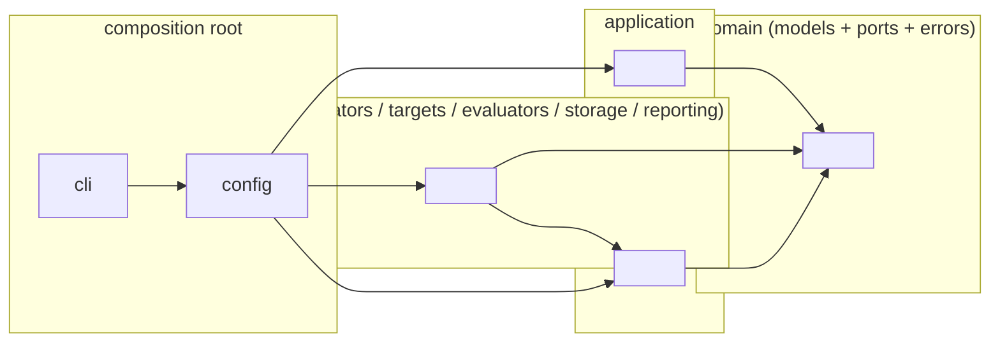
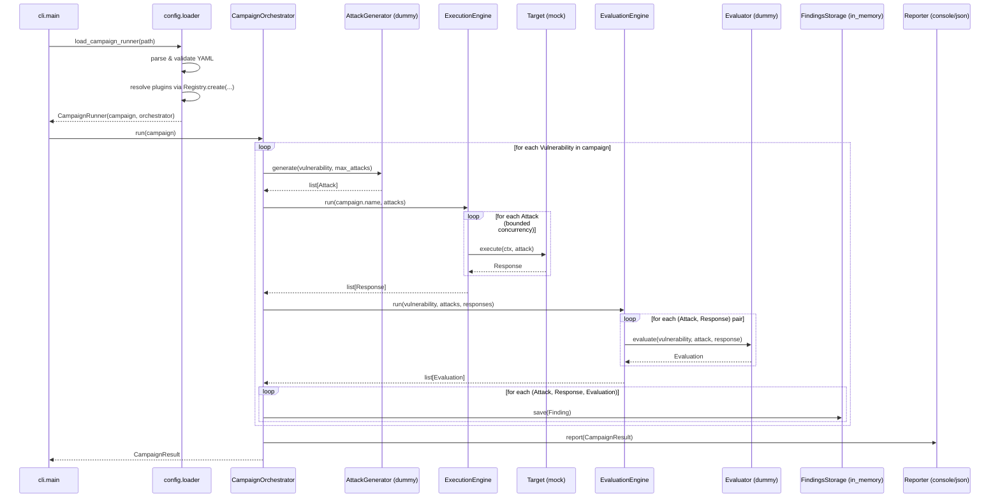

# Architecture

`llm-redteam-firewall` follows Clean Architecture / Hexagonal Architecture:
domain logic sits at the center, knows nothing about frameworks or I/O, and
everything else — adapters, config, CLI — depends *inward* on it, never the
reverse.

## 1. Folder structure

```
llm-redteam-firewall/
├── pyproject.toml
├── Makefile
├── README.md
├── ARCHITECTURE.md
├── LICENSE
├── configs/
│   └── example_campaign.yaml
├── examples/
│   └── run_example_campaign.py
├── src/
│   └── llm_redteam_firewall/
│       ├── __init__.py
│       ├── domain/                    # innermost ring: zero dependencies
│       │   ├── errors.py
│       │   ├── models/                # entities & value objects (dataclasses)
│       │   │   ├── severity.py
│       │   │   ├── vulnerability.py
│       │   │   ├── attack.py
│       │   │   ├── response.py
│       │   │   ├── evaluation.py
│       │   │   ├── finding.py
│       │   │   ├── execution_context.py
│       │   │   └── campaign.py
│       │   └── ports/                 # interfaces (typing.Protocol)
│       │       ├── attack_generator.py
│       │       ├── target.py
│       │       ├── evaluator.py
│       │       ├── storage.py
│       │       └── reporter.py
│       ├── application/               # use cases, depends only on domain
│       │   ├── campaign_orchestrator.py
│       │   ├── execution_engine.py
│       │   └── evaluation_engine.py
│       ├── adapters/                  # concrete port implementations
│       │   ├── generators/            # dummy (functional), garak (stub)
│       │   ├── targets/               # mock, callback (functional);
│       │   │                          # openai, anthropic, http, local_model,
│       │   │                          # langgraph (stubs)
│       │   ├── evaluators/            # dummy (functional), llm_judge (stub)
│       │   ├── storage/               # in_memory (functional), sqlite (stub)
│       │   └── reporting/             # console, json (functional); markdown (stub)
│       ├── plugins/                   # Registry + entry-point discovery
│       │   └── registry.py
│       ├── config/                    # composition root: YAML -> wired campaign
│       │   ├── schema.py              # pydantic models
│       │   └── loader.py              # dependency injection happens here
│       └── cli/
│           └── main.py
└── tests/
    ├── domain/
    ├── application/
    ├── adapters/
    ├── plugins/
    └── config/
```

## 2. Dependency direction



Rules, enforced by convention (and checkable with an import-linter-style tool
later, see *Future extension points*):

- `domain` imports nothing from this project.
- `application` imports only `domain`.
- `adapters.*` import `domain` and `plugins` (to self-register); never
  `application`, never each other.
- `plugins` imports only `domain.ports` (for typing the registries).
- `config` is the **composition root** — the only package allowed to import
  `application`, `adapters`, and `plugins` all at once, and the only place
  concrete adapter classes get instantiated.
- `cli` imports only `config`.

The practical effect: `CampaignOrchestrator` (in `application`) has never
heard of `OpenAITarget` or `DummyAttackGenerator`. It only knows the
`Target`, `AttackGenerator`, `Evaluator`, `FindingsStorage`, and `Reporter`
`Protocol`s from `domain.ports`.

## 3. Plugin architecture

Each port has a matching `Registry[T]` in `llm_redteam_firewall.plugins`
(`GENERATORS`, `TARGETS`, `EVALUATORS`, `STORAGE`, `REPORTERS`). Adapters
register themselves by name, either:

**In-tree**, via decorator (see e.g. `adapters/generators/dummy_generator.py`):

```python
@GENERATORS.register("dummy")
class DummyAttackGenerator:
    ...
```

**Out-of-tree**, via a setuptools entry point in a *separate* package's
`pyproject.toml`:

```toml
[project.entry-points."llm_redteam_firewall.generators"]
garak = "llm_redteam_garak.generator:GarakAttackGenerator"
```

`Registry.discover_entry_points()` loads these lazily on first lookup,
using the group naming convention `llm_redteam_firewall.<category>`
(`generators`, `targets`, `evaluators`, `storage`, `reporters`).

The composition root (`config/loader.py`) resolves plugins purely by the
string in `type:` from the campaign YAML — `GENERATORS.create(spec.type,
**spec.params)` — so adding a real `GarakAttackGenerator` later means
writing one file (or one external package) and changing a config value.
No orchestration, engine, or CLI code changes.

## 4. Configuration system

`config/schema.py` defines the YAML shape with Pydantic (`CampaignConfig`,
`PluginSpec`, `VulnerabilityConfig`) — this is the framework's only use of
Pydantic, since config parsing is exactly the kind of untrusted-input
boundary Pydantic is for. `config/loader.py`:

1. `load_campaign_config(path)` — parse + validate YAML into `CampaignConfig`.
2. `build_campaign_runner(config)` — the **dependency-injection** step:
   resolve each `PluginSpec` through the matching registry, construct
   `ExecutionEngine`/`EvaluationEngine` around the resolved target/evaluator,
   and inject everything into a `CampaignOrchestrator`.

## 5. Example campaign execution — sequence diagram

This is what `examples/run_example_campaign.py` and
`llm-redteam-firewall run --config configs/example_campaign.yaml` both do,
using the dummy/mock/in-memory reference adapters.



## 6. Future extension points

Each of these is a scaffold stub today (`NotImplementedError` bodies,
already registered under a plugin name) — implementing one never requires
touching `domain`, `application`, `plugins`, or `cli`:

| Extension | Where | Notes |
|---|---|---|
| `GarakAttackGenerator` | `adapters/generators/garak_generator.py` (or a separate `llm-redteam-garak` package) | Map `Vulnerability.category` to Garak probes; wrap probe output as `Attack`s. The whole reason `AttackGenerator` is a `Protocol` rather than a base class you must subclass. |
| Real `OpenAITarget` / `AnthropicTarget` | `adapters/targets/` | Wire in the respective SDK behind the existing constructor signatures. |
| `HTTPTarget` | `adapters/targets/http_target.py` | Add `httpx`, POST `attack.prompt`, parse the configured response field — works against a FastAPI service or any other HTTP backend. |
| `LocalModelTarget` | `adapters/targets/local_model_target.py` | Lazy-load a `transformers`/`vllm`/`llama.cpp` model once, not per call. |
| `LangGraphTarget` | `adapters/targets/langgraph_target.py` | Invoke a compiled graph; record intermediate steps in `Response.raw`. |
| `LLMJudgeEvaluator` | `adapters/evaluators/llm_judge_evaluator.py` | Prompt a judge model with a grading rubric; parse a structured verdict. |
| `SQLiteStorage` | `adapters/storage/sqlite_storage.py` | Durable local persistence with only the stdlib `sqlite3` module. |
| `MarkdownReporter` | `adapters/reporting/markdown_reporter.py` | Render a `CampaignResult` as a PR-friendly Markdown doc. |
| Multi-turn / conversational attacks | new `Attack` shape (`prompt: str` -> `turns: list[str]`) | Would touch `domain.models.attack` and every `Target.execute` implementation, but not the orchestrator's control flow. |
| Retry/backoff policy | `application.execution_engine.ExecutionEngine` | Currently one attempt + timeout; a policy object could wrap the `target.execute` call. |
| Import-boundary enforcement in CI | new `tool.importlinter` config | Encodes the dependency-direction rules in §2 as an automated check. |
